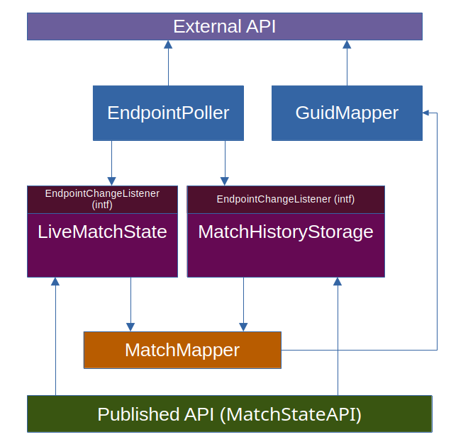
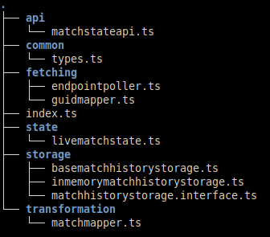

# Solution Description

(the description of the interview task: [README](./README.md))

This solution implements a real-time sports event monitoring system that continuously processes match data from a simulation API. The system maintains both live state and historical records of matches.

The architecture follows an event-driven approach with clear separation between data acquisition (polling), state management, data processing, and API exposure. This design ensures reliable data capture while providing a clean interface for consumers to access both current and historical match information.

## EndpointPoller
**EndpointPoller** is a robust endpoint scanning mechanism for watching a URL and notifying registered
listeners when a change has appeared. Listeners implement the **EndpointChangeListener** interface.

The scanning interval is configurable (0 = request continuously, >= 1 wait milliseconds between
requests.)

If the endpoint is down, a backoff mechanism makes sure that it does not overwhelm it when it comes
back up.

**EndpointPoller** is used to scan the assignments /api/state endpoint.

## LiveMatchState
**LiveMatchState** implements the **EndpointChangeListener** interface and keeps a state of the current
running matches (status PRE, LIVE).

It uses **MatchMapper** to transform to the output format from the incoming match data.

## MatchHistoryStorage
**MatchHistoryStorage** implements the **EndpointChangeListener** interface and stores a record of each
change that has happened to all matches it encounters.

It stores both the raw data and the output format data together with a timestamp when the change was
encountered. All those changes are stored consecutively and provide a history of everything that has
happened during a match.

When a match that was previously running (status LIVE) suddenly disappears from the incoming match data
it creates a new record in that match history which is a copy of the last match state but sets a new
status on that last record with status REMOVED (to fulfill the task requirement.)

The MatchHistoryStorage has an interface **IMatchHistoryStorage** and a class base class
**BaseMatchHistoryStorage** that can be used to easily implement storage on almost any persistence
mechanism.

The only real implementation provided in the solution is the **InMemoryMatchHistoryStorage**.

## MatchMapper

**MatchMapper** is able to parse the records of the incoming data of individual matches and uses
**GuidMapper** to resolve the GUID values in the incoming records.

## GuidMapper

**GuidMapper** allows the user to lookup string values based on a GUID. It is used in conjunction
with the assignments /api/mappings endpoint to get new GUIDs as they are needed.

It will only touch the /api/mappings endpoint if a new unknown GUID is encountered as historic GUIDs
are cached.

## MatchStateAPI

**MatchStateAPI** implements the Express.js request handlers for the HTTP API and uses **LiveMatchState** and
**MatchHistoryStorage** as it's sources.

## Settings

| Setting Name                       | Environment Variable       | Default Value                        |
|------------------------------------|----------------------------|--------------------------------------|
| HTTP API Port (published)          | `PORT`                     | `4000`                               |
| Log Level                          | `LOG_LEVEL`                | `INFO`                               |
| Match (odds) Pollng intervall (ms) | `ODDS_POLLING_INTERVAL_MS` | `100`                                |
| Match data (odds) URL              | `ODDS_ENDPOINT`            | `http://127.0.0.1:3000/api/state`    |
| Guid to string mapping URL         | `MAPPING_ENDPOINT`         | `http://127.0.0.0:3000/api/mappings` |

## API Endpoints

| Endpoint Description                                      | Path                      |
|-----------------------------------------------------------|---------------------------|
| Retrieve live match state                                 | `/state`                  |
| Retrieve the current state of all matches encountered     | `/internalstate`          |
| Retrieve all the events (changes) to a match by it's GUID | `/matchhistory/:match_id` |

### Files of the solution
